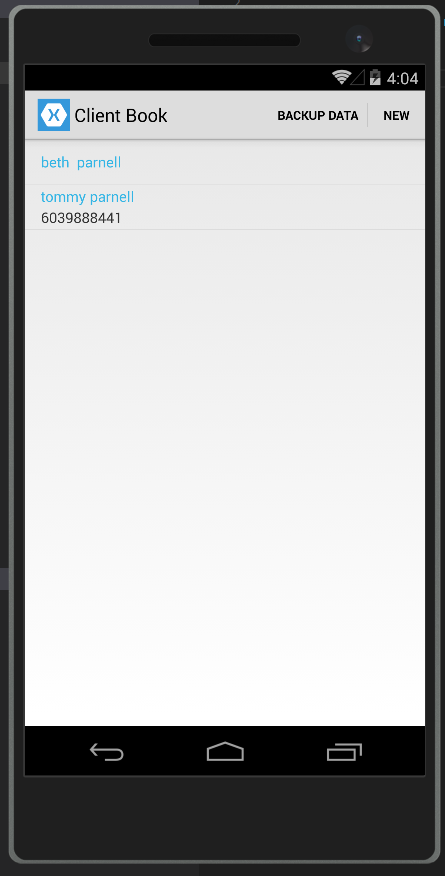
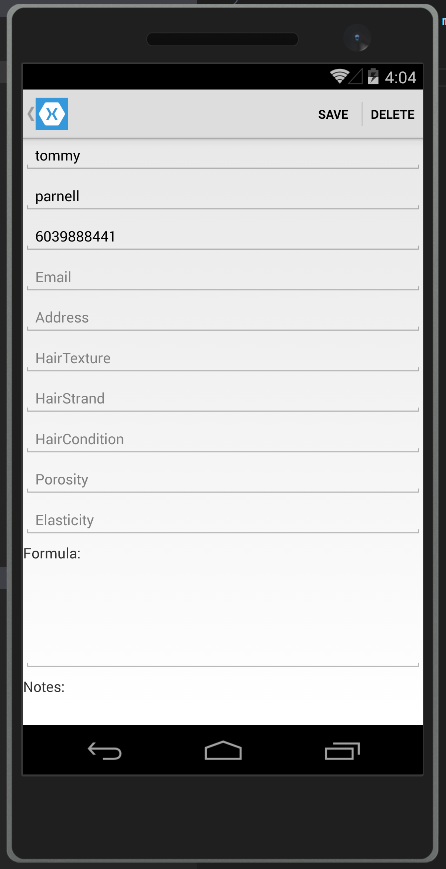

## HairDresser.Companion

Xamarin.Forms app I made for my wife. She is a hair dresser and wanted a way to store basic info about clients...

This uses localsql for offline sync (since she often is places that do not have good internet) and uses azure mobile app services to backup the data to azure easy tables

 